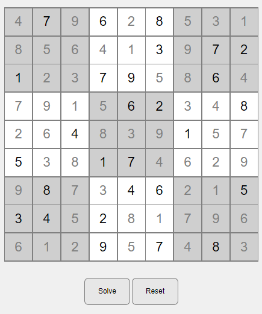
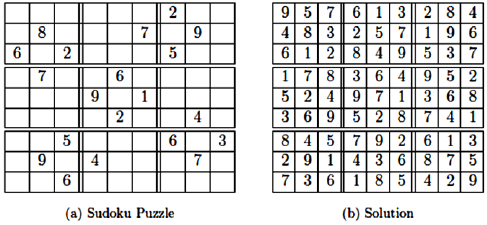

# Sudoku Solver

A simple sudoku solver using Vanilla Javascipt.
Backtracking algorithm idea from [Python Sudoku Solver - Computerphile](https://www.youtube.com/watch?v=G_UYXzGuqvM)
Check out the [Live Demo](https://NJVS.github.io/Sudoku-solver)

### ScreenShot

### Issue

I don't know why, but for some reason, the algorithm takes a long time to solve this problem.
